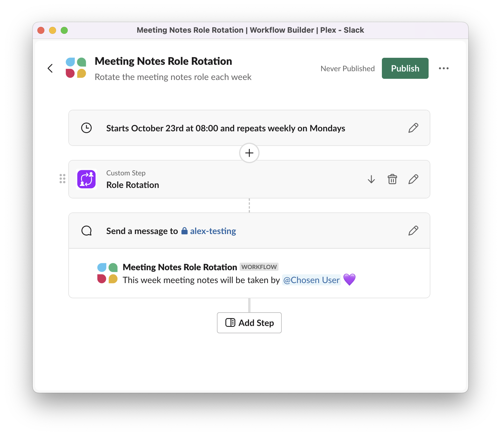
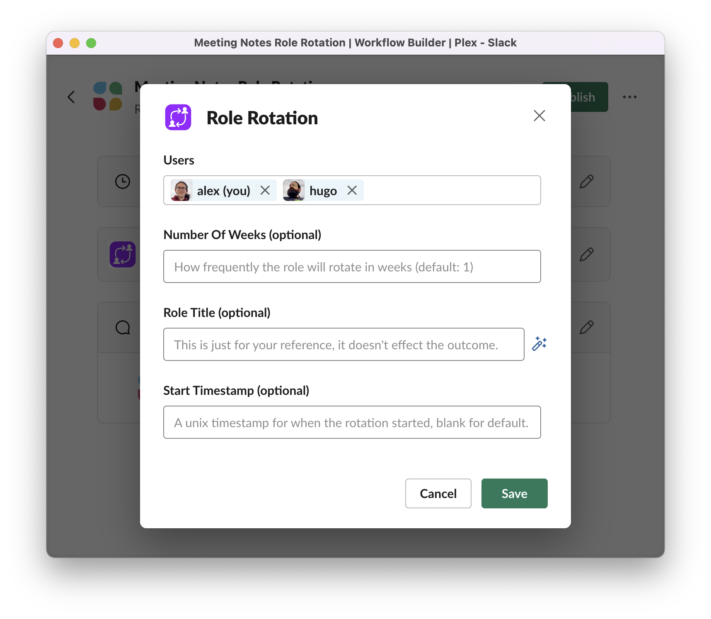

# Slack Role Rotation Workflow Function
A simple Slack workflow function to rotate a role based on the date. (e.g. weekly)

| Example Workflow | Editing Example |
| ------- | ------- |
|  |  |

If you want to figure out how you deploy it etc, you can follow [Slack's custom workflow function tutorial](https://api.slack.com/tutorials/tracks/wfb-function), which would probably also help you understand the structure if you want to tweak it.
